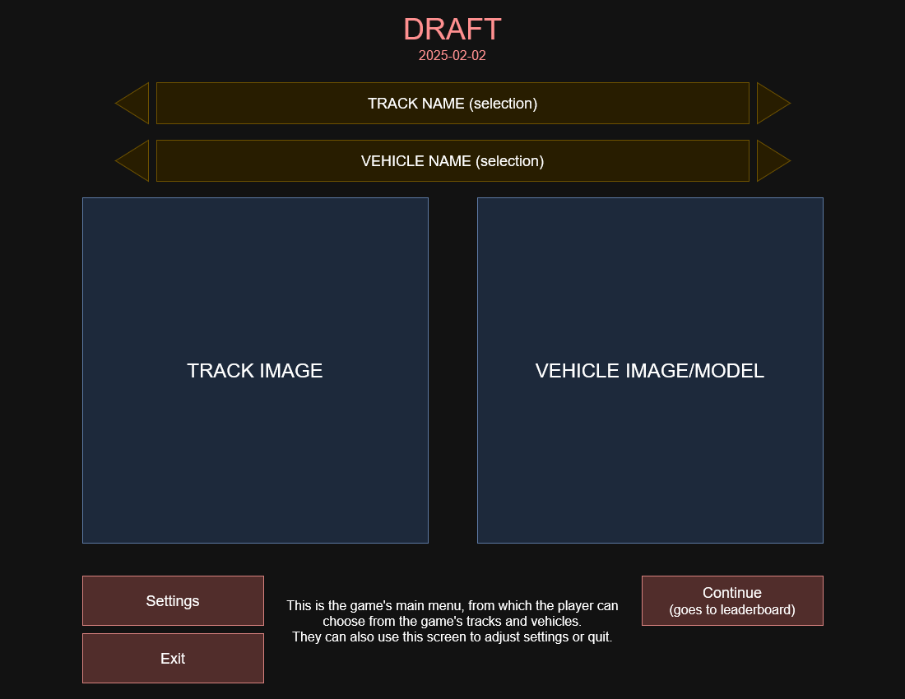
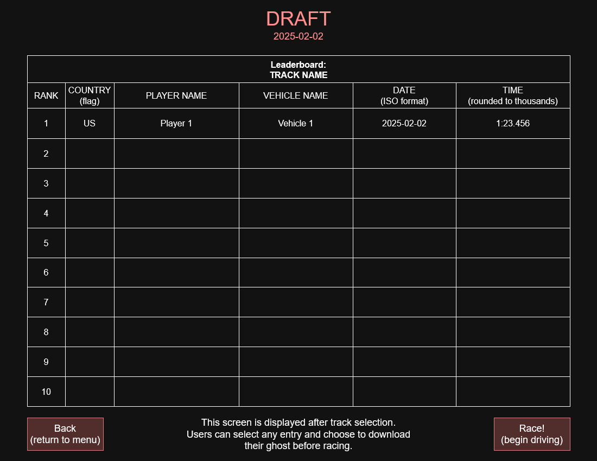
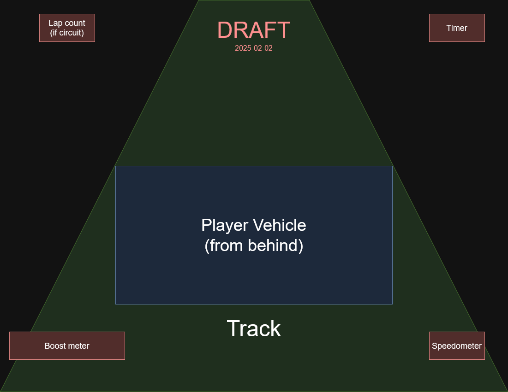
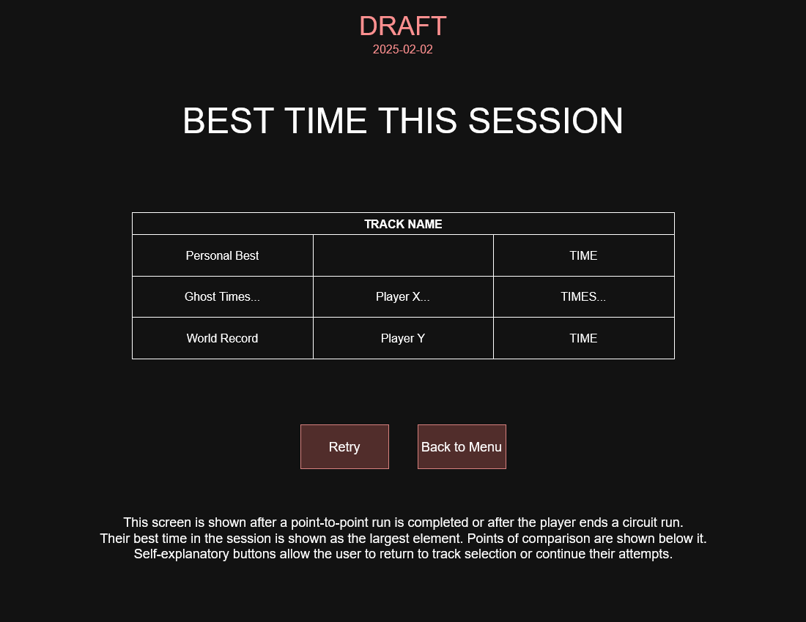

# Overview
Arcade Racer is a single-player time trial-based arcade racing game. It contains multiple unique vehicles for the player to use on both circuit and point-to-point tracks. The player’s best time on each track is uploaded to an online leaderboard, where it is visible to other players so they can compete to get the best time. This leaderboard is only available in-game, but developers have access to a webpage for entry management.

Due to the importance of the leaderboards, a significant amount of data is available in each entry. The player ID, time, track, vehicle used, and date of submission are stored and made available via a cloud server. In addition, each entry has an associated “ghost” available for download—that is, a no-collision replay of the run that the player can drive alongside, achieved by tracking the player position and direction over time. A third-party user account system is utilized to ensure users cannot set times on someone else’s account. The game is being developed in Unreal Engine 5.5 for the PC platform, though it does not use any of the engine's new graphically intensive features.

# Architecture

# Wireframe Sketches
## Menu

## Leaderboard

## Driving

## Results

# User Stories
1. As a player, I need to be able to choose the setup I want (such vehicles and tracks) before playing, so that I feel there is variety in the game that increases my sense of enjoyment.
2. As a player, I want to be able to see details of each run on the leaderboard (such as the vehicle used), so that I can attempt to match those settings and more successfully compete against others.
3. As a player, I want to see replays of my best times (and those of others), so that I can compare my own runs against them and improve my times on each track.
4. As a player who is not interested in leaderboards, I want to unlock new vehicles and tracks as the game progresses, so that I can still maintain a sense of achievement when playing through the game.
5. As a maintainer, I need to be able to moderate the leaderboards effectively, so that players do not have to worry about cheaters and can have a better overall experience with the game.

# Use Cases

# Use Case Diagram

