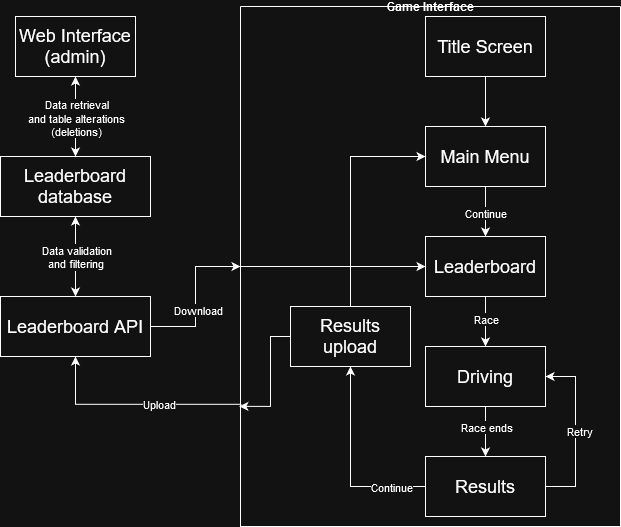

# Overview
Arcade Racer is a single-player time trial-based arcade racing game. It contains multiple unique vehicles for the player to use on both circuit and point-to-point tracks. The player’s best time on each track is uploaded to an online leaderboard, where it is visible to other players so they can compete to get the best time. This leaderboard is only available in-game, but developers have access to a webpage for entry management.

Due to the importance of the leaderboards, a significant amount of data is available in each entry. The player ID, time, track, vehicle used, and date of submission are stored and made available via a cloud server. In addition, each entry has an associated “ghost” available for download—that is, a no-collision replay of the run that the player can drive alongside, achieved by tracking the player position and direction over time. A third-party user account system is utilized to ensure users cannot set times on someone else’s account. The game is being developed in Unreal Engine 5.5 for the PC platform, though it does not use any of the engine's new graphically intensive features.

# Requirements
| ID | Description |
| --- | --- |
| 1 | The game must upload the time for a given track with the correct user identifier attached upon successful completion of a run. |
| 2 | The leaderboard must be able to provide any requested information for an entry (rank, time, username, player country, date set, and vehicle used). |
| 3 | The game should be able to download and view the "ghost" associated with a leaderboard entry when the player chooses to do so. |
| 4 | The game must be able to be run completely offline while still being fully functional, barring situations where online connectivity is strictly required. |
| 5 | The leaderboard must be able to be moderated through the web interface by administrators and maintainers. |

# Architecture

# Wireframe Sketches
## Menu

## Leaderboard

## Driving

## Results

# User Stories
1. As a player, I need my times to be uploaded to the leaderboards, so that I can compete with the rest of the world.
2. As a player, I want to be able to see details of each run on the leaderboard (such as the vehicle used), so that I can attempt to match those settings and more successfully compete against others.
3. As a player, I want to see replays of my best times (and those of others), so that I can compare my own runs against them and improve my times on each track.
4. As a player who is not interested in online leaderboards, I want to play the game without having to access them, so I can play the game entirely offline and just compete against my own times.
5. As a maintainer, I need to be able to moderate the leaderboards effectively, so that players do not have to worry about cheaters and can have a better overall experience with the game.

# Use Cases
## Leaderboard upload
- Description: A new best time is set and uploaded.
- System: Leaderboard API and database
- Actor: Player
- Scenario: The player opens the game, logs in, and proceeds normally into gameplay. There, they set a new personal best on the track they've chosen. They return to the menu and view the track's leaderboard.
- Result: The new personal best time is uploaded under the player's name, replacing any slower time that was there previously. The new time is clearly visible on the leaderboard.

## Viewing additional information
- Description: Additional information about a time (in this case, the vehicle used) is sought and viewed.
- System: Leaderboard API and database
- Actor: Player
- Scenario: The player wishes to know what vehicle was used to set the world record on a particular track. At the menu screen, they select the track and any vehicle, then continue to the leaderboard screen.
- Result: Information on the entry is retrieved from the database. This information, including the vehicle used, is displayed.

## Ghost download
- Description: Ghosts are selected and downloaded for use in-game.
- System: Leaderboard API and database
- Actor: Player
- Scenario: A vehicle and track have been selected and the player is now at the leaderboard screen. They choose a few entries, selecting the option to download the ghost from each, and proceed to gameplay.
- Result: Ghosts are successfully retrieved and are visible on the track.

## Offline play
- Description: The game is being played with no internet connection.
- System: Local game and leaderboard API
- Actor: Player
- Scenario: A computer with no Internet connection is used to run the game. The player proceeds normally through the title screen, menu, and leaderboard to reach gameplay.
- Result: No errors occur due to the lack of Internet, thanks to the API functions returning values indicating offline play. The leaderboard is unpopulated, but the player's personal best time and ghost are still shown (based on data stored in their savegame). After gameplay, the results screen displays the times without looking for a record on the online leaderboard.

## Leaderboard moderation
- Description: The admin-only web interface is used to delete an illegitimate entry.
- System: Web interface for leaderboard management
- Actor: Maintainer
- Scenario: The leaderboard has received a clearly illegitimate entry. The automatic filters will have to be updated to truly solve the problem, but in the meantime, the entry needs to be deleted. The maintainer opens the web interface for managing the leaderboard, logs in, chooses the relevant track, navigates to the entry, and clicks delete. The maintainer verifies the result and logs out.
- Result: As the maintainer clicks delete, on the backend, a query is sent that deletes the associated entry from the database. Players no longer see the entry on the leaderboard.

# Use Case Diagram

# Entity Relationship Diagram

# UML Class Diagram

