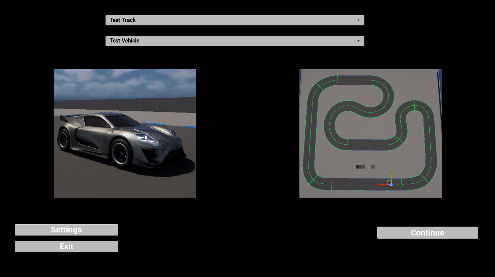
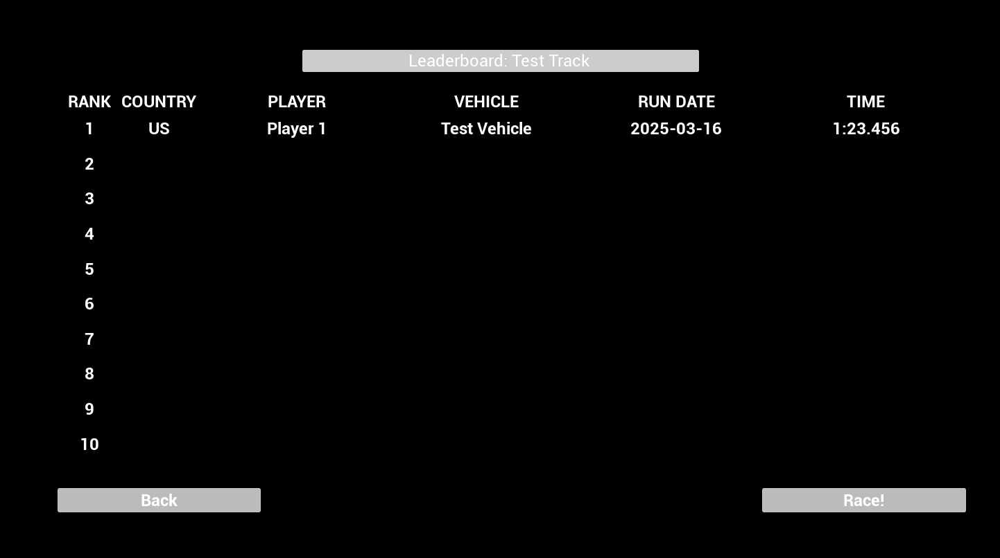
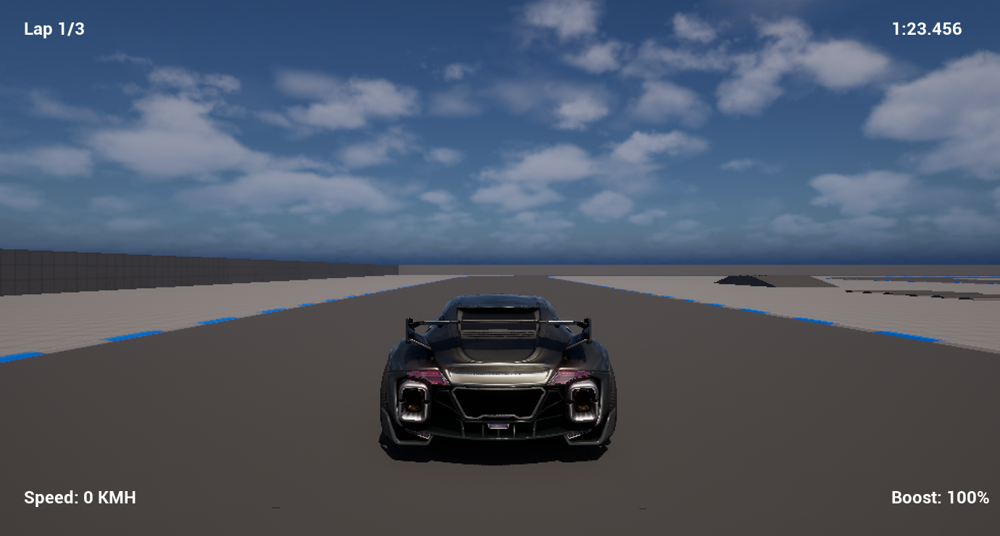
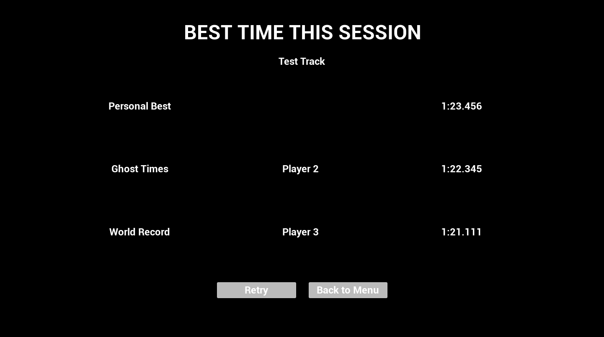

# Arcade Racer Prototype

The arcade racer game begins at the main menu, where the vehicle and track can be selected. There are buttons for continuing to the leaderboard, opening a page for adjusting the settings (not yet implemented), and quitting the game.

Assuming the player continues to the leaderboard page, they will be able to select times from it to compete against. Each entry reveals the player's name, the player's country, the time set, what vehicle was used, the date the time was set on, and the rank this time earned on the leaderboard. From here, the player can either go back to the main menu or start the race.

Once in a race, the player can see what lap they are on, the current lap time, their speed, and the amount of boost they have left.

After the player has completed the event, they will be met with the results screen, which shows their current standings against their chosen rivals and the world record. From here, they retry the event or return to the main menu.

