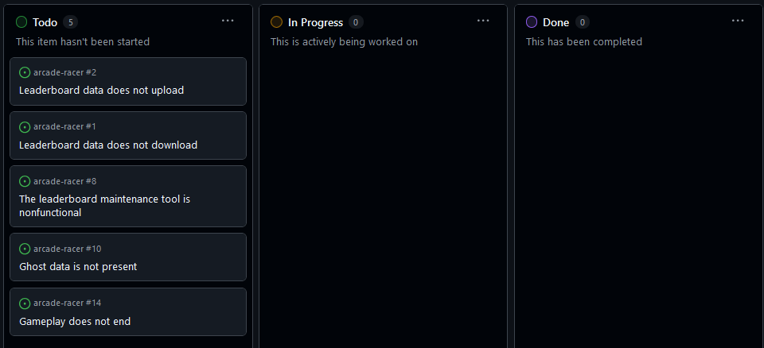
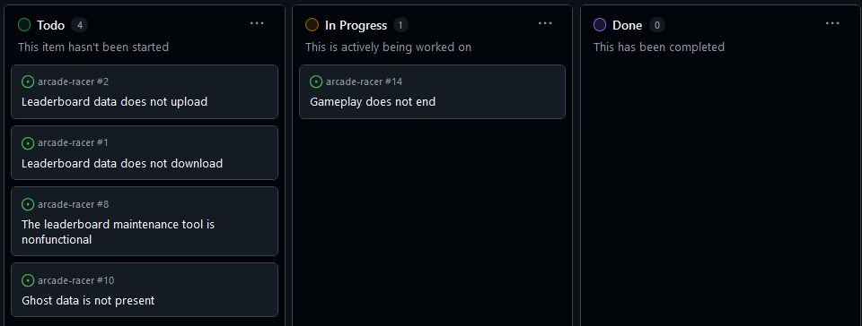
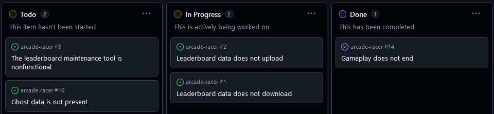
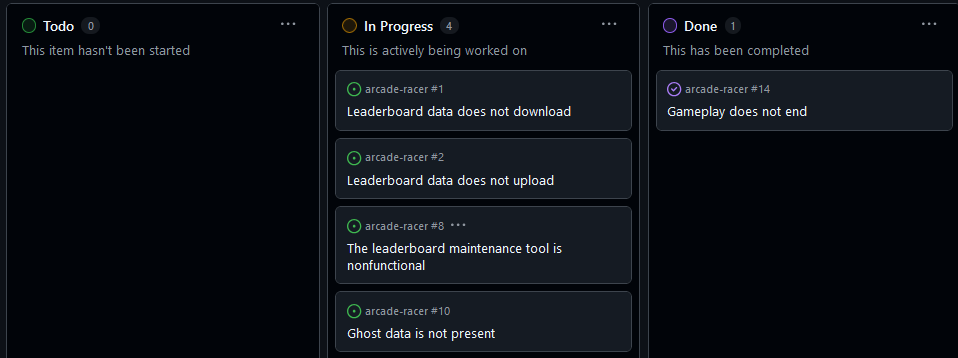
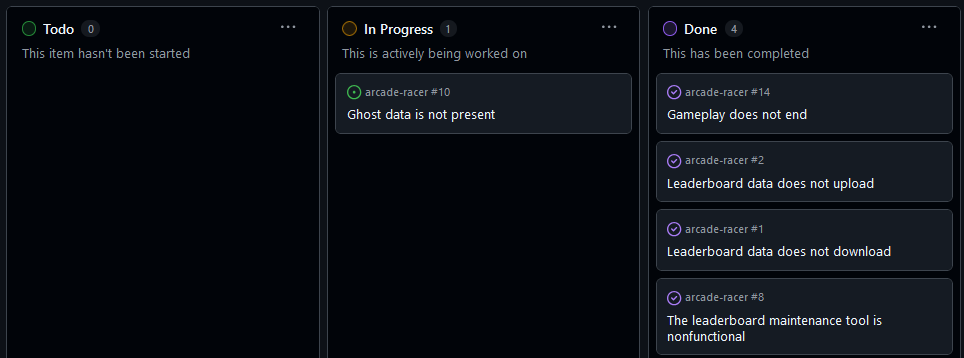
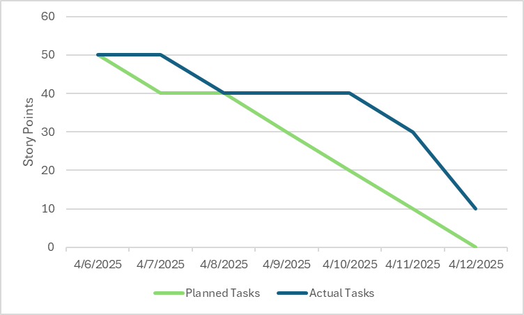
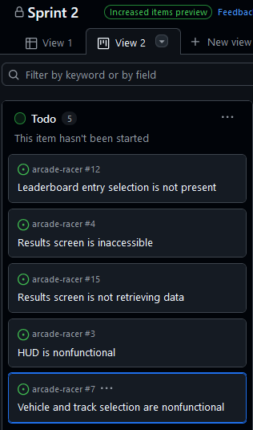

# Daily kanban board screenshots

## 4/6/25-4/7/25

## 4/8/25

## 4/9/25-4/10/25

## 4/11/25

## 4/12/25-4/13/25

# Burndown chart

# Sprint review

1. I completed 4 of the 5 items in the sprint plan.
2. The game now has leaderboard functionality.
3. There was little task volatility; the scope remains unchanged.
4. The biggest problem was attempting to combine work on different issues, leaderboards and ghosts. I quickly learned that these were too distinct to work on at the same time and decided to prioritize implementing leaderboards. Ghosts have been pushed to the third sprint plan.

# Sprint 2 plan

